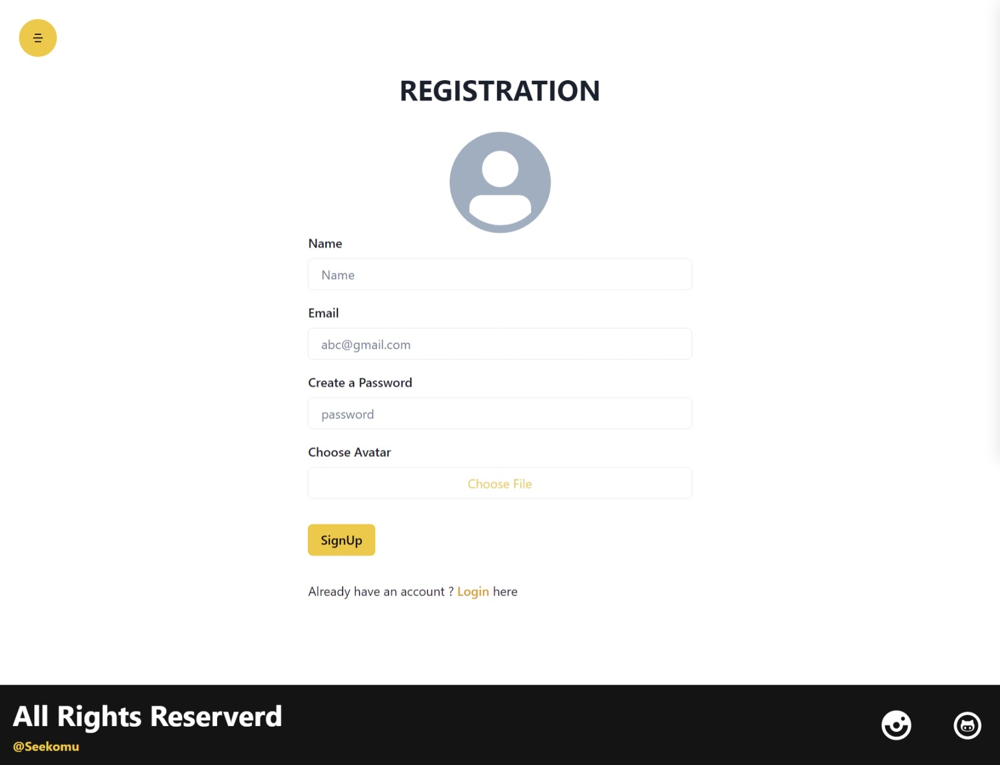
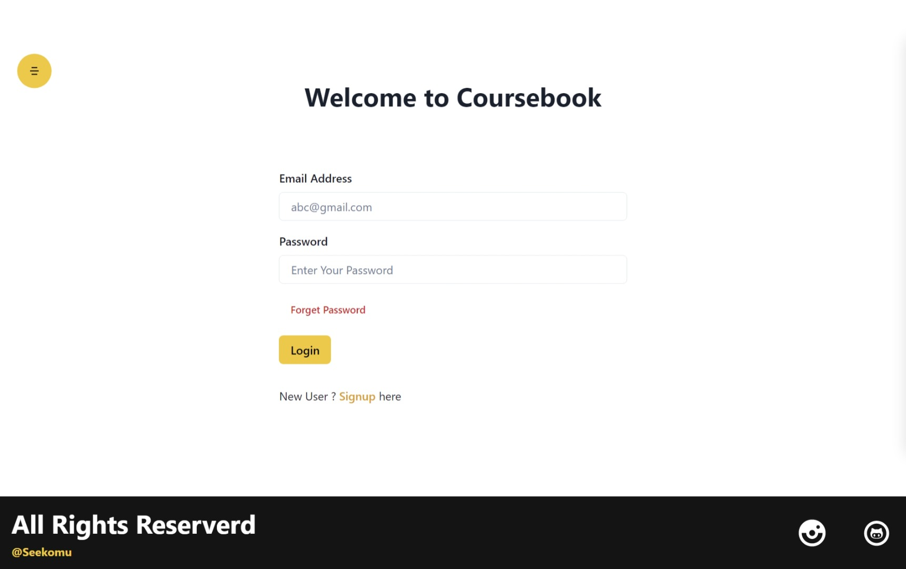
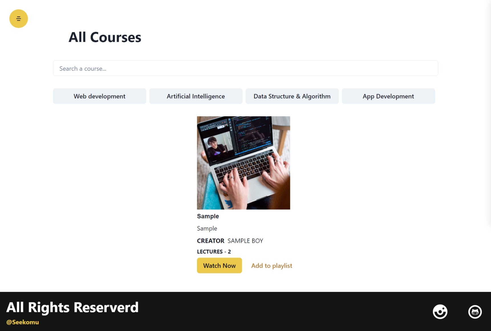
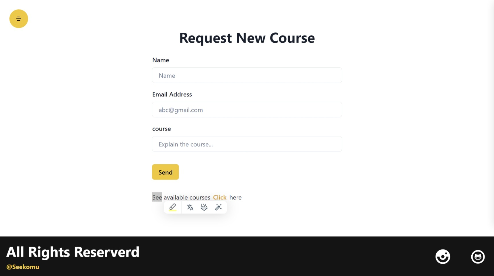

# Coursebook Project (MERN Stack)

This is a Online Study App built using MERN stack (MongoDB, Express, React.js, Node.js). It allows users to register, choose course, watch playlist videos, request a new course, contact us.

## Table of contents

- [Installation](#installation)
- [usage](#usage)
- [API Routes](#api-routes)
- [Technologies Used](#technologies-used)
- [Contributing](#contributing)
- [License](#license)
- [Contact](#contact)

## Installation

1. Clone the repository:

```bash
git clone https://github.com/Sandeeplakhiwal/coursebook.git
```

2. Navigate to the project directory:
   cd coursebook

3. Navigate to the client directory:
   cd client

4. Install client dependecies:
   npm install

5. Go back to the project directory
   cd ..

6. Start the development server
   npm run dev

7. Open your browser and visit `http://localhost:5173` to see the application

## Usage

- Register a new user account
  

- Log in with your credentials
  
- Purshase premium subscription to access courses available on this app

- Select an course you are interested in
  
- Click watch now and enjoy the learning.

- You can request a new course according to your preference
  

## API Routes

- `/api/v1/users`: User registration and authentication routes.
- `/api/v1/courses`: Routes for access the courses availanle on this app.

For more details, refer to the API documentation in the `API.md` file.

## Technologies Used

- MongoDB: Database for storing user information, courses, subscritions and transaction.
- Express.js: Web application framework for building the server.
- React.js: JavaScript library for building the user interface.
- Node.js: JavaScript run time environment for running the server.
- Mongoose: MongoDB object modeling tool.
- Axios: Promise-based HTTP client for making API requests.
- MUI: CSS framework for styling the frontend.
- ChakraUI: simple, modular and accessible component library that gives the building blocks, need to build React applications.

## Contributing

Contributions are welcome! If you find any bugs or have suggestions for improvements, please submit an issue or open a pull request.

Please follow the `contribution guidelines` when contributing to this project.

## Licence

This project is licensed under the MIT License.

## Contact

If you have any questions, feel free to reach out:

- Email: `sandeeplakhiwal98@gmail.com`
- Twitter: `https://twitter.com/SandeepLakhiwa2`
- Github: `https://github.com/Sandeeplakhiwal`
- Instagram: `https://instagram.com/sandeep.lakhiwal`
